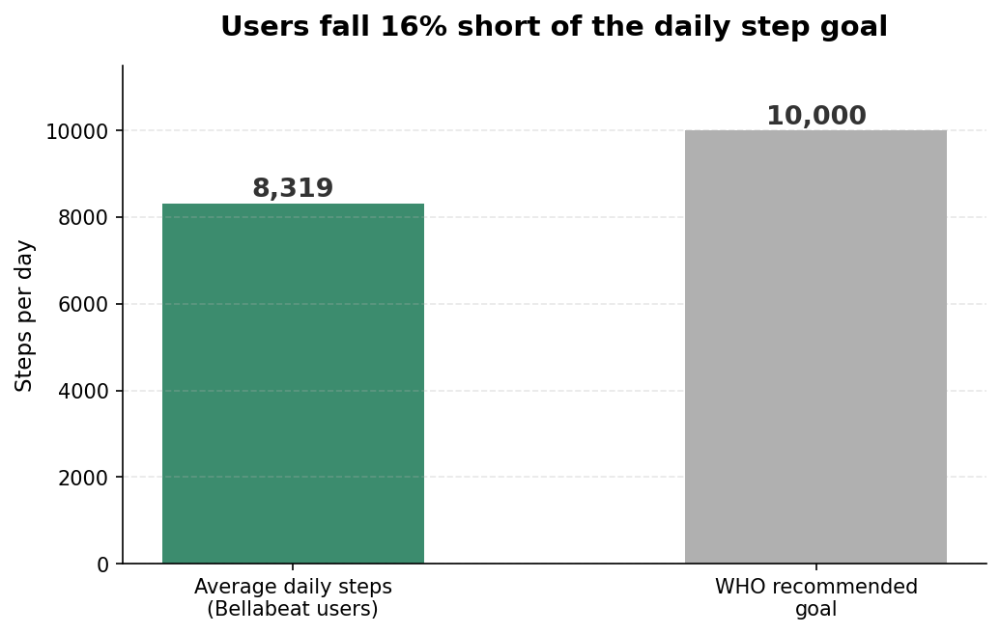
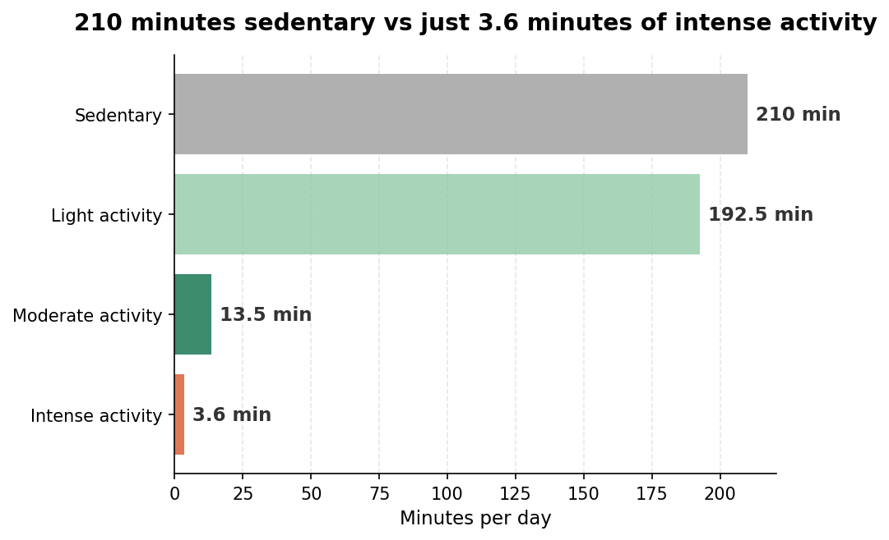
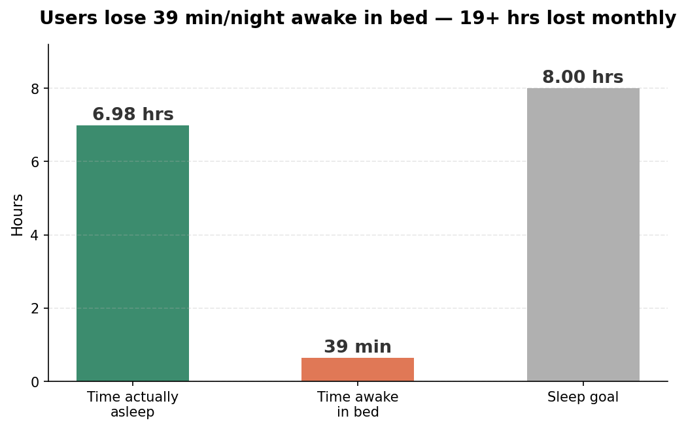

# bellabeat-case-study
Data analysis of smart device usage (FitBit dataset) to generate marketing recommendations for Bellabeat's Leaf tracker. Google Data Analytics Capstone — covers activity, sedentary time, and sleep patterns across 30 users, with 3 actionable product recommendations.
# Bellabeat Smart Device Analysis
Google Data Analytics Capstone — Nouman Siddiq

## The problem
Bellabeat, a wellness tech company making smart devices for women, wanted to understand how consumers use non-Bellabeat smart devices to guide marketing strategy for their Leaf tracker.

## The approach
Used a public FitBit dataset (30 users, 2016) covering daily activity, steps, sleep, and intensity minutes. Followed the full analysis cycle — ask, prepare, process, analyze, share, act — in Excel, with pivot tables and visualizations. Limitations (small sample, dated, ROCCC criteria) are acknowledged rather than overstated.

## Key findings

Users averaged 8,319 steps/day — 16% below the WHO-recommended 10,000.

210 minutes/day sedentary vs just 3.6 minutes of intense activity.

39 minutes/night lost lying awake in bed — over 19 hours of poor sleep monthly.

## Recommendations
1. Daily step challenge with push notifications on low-activity days (Friday, Sunday)
2. Hourly sedentary alerts after 60+ minutes of inactivity
3. Sleep hygiene programme — wind-down reminders, breathing exercises, sleep quality score

## Files
- `Bellabeat_Case_Study_Nouman.xlsx` — full analysis workbook
